# Apple Watch Architecture for EatThisDie

**Version:** 1.0  
**Date:** 2025-09-29  
**Status:** Planning Phase  
**Target Platforms:** iOS 16+, watchOS 9+

---

## Table of Contents

1. [Overview](#overview)
2. [Calendar Workaround Implementation](#calendar-workaround-implementation)
3. [Native watchOS Widget Approach](#native-watchos-widget-approach)
4. [Full watchOS App Architecture](#full-watchos-app-architecture)
5. [Recommended Implementation Strategy](#recommended-implementation-strategy)
6. [Technical Implementation Guides](#technical-implementation-guides)
7. [Design Specifications for Watch](#design-specifications-for-watch)
8. [Data Flow Architecture](#data-flow-architecture)
9. [Security and Privacy Considerations](#security-and-privacy-considerations)
10. [Appendices](#appendices)

---

## Overview

This document outlines three distinct approaches for displaying glucose data on Apple Watch within the EatThisDie diabetes management system. Each approach offers different trade-offs in complexity, development time, user experience, and maintenance requirements.

### Why Apple Watch?

Apple Watch provides critical at-a-glance glucose monitoring capabilities:
- **Glanceable data**: Check glucose without pulling out phone
- **Always accessible**: Glucose visible on watch face complications
- **Contextual awareness**: Quick reference during activities, meals, and exercise
- **Notification delivery**: Haptic alerts for out-of-range glucose levels

### Three Approaches Compared

| Approach | Development Time | Complexity | Native Experience | Maintenance |
|----------|-----------------|------------|-------------------|-------------|
| **Calendar Workaround** | 1-2 weeks | Low | Limited | Low |
| **WidgetKit Complications** | 2-3 weeks | Medium | Good | Medium |
| **Full watchOS App** | 4-6 weeks | High | Excellent | High |

### Architecture Integration

All approaches integrate with EatThisDie's existing **HealthKit-centric architecture**:

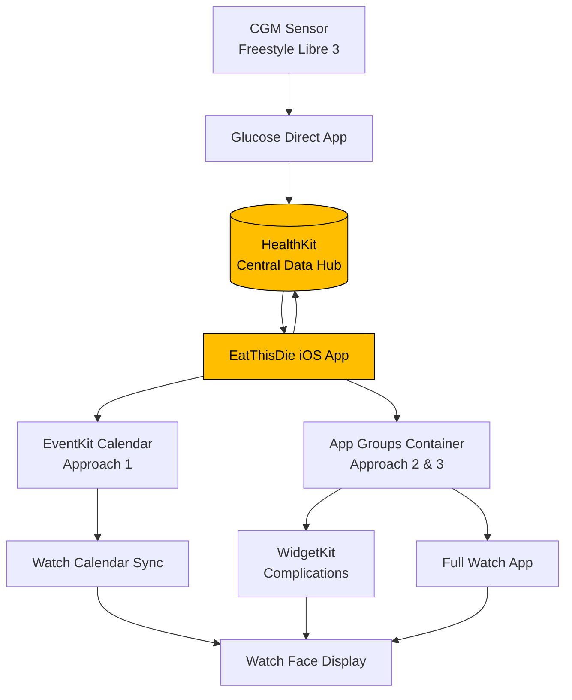

---

## Calendar Workaround Implementation

### Overview

The **Calendar Workaround** leverages Apple's EventKit framework to write glucose values as calendar events. The Apple Watch automatically syncs calendars and displays event titles in calendar complications, providing a zero-code watchOS solution.

**Inspiration:** This approach is successfully used by [Glucose Direct](https://github.com/creepymonster/GlucoseDirect) (commit d41e21d).

### How It Works

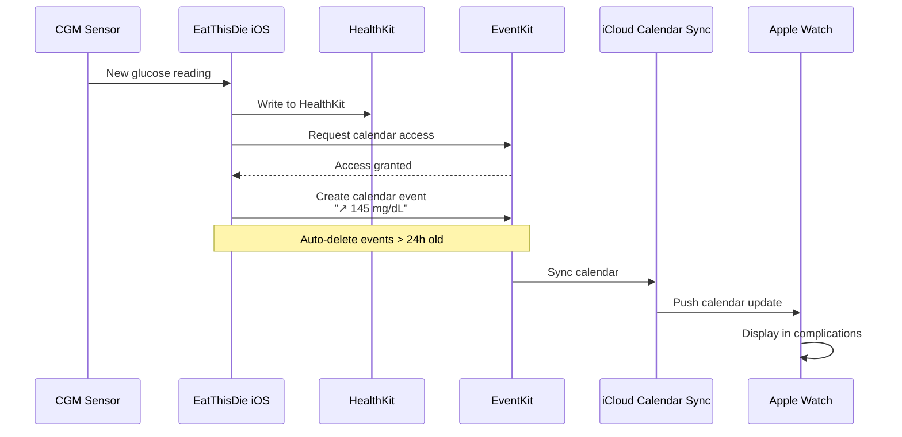

### EventKit Integration

#### 1. Request Calendar Access

```swift
import EventKit

class GlucoseCalendarExporter {
    private let eventStore = EKEventStore()
    private var targetCalendar: EKCalendar?
    
    func requestAccess(completion: @escaping (Bool) -> Void) {
        if #available(iOS 17.0, *) {
            eventStore.requestFullAccessToEvents { granted, error in
                completion(granted && error == nil)
            }
        } else {
            eventStore.requestAccess(to: .event) { granted, error in
                completion(granted && error == nil)
            }
        }
    }
    
    func selectCalendar(named calendarName: String) {
        targetCalendar = eventStore.calendars(for: .event)
            .first(where: { $0.title == calendarName })
    }
}
```

#### 2. Calendar Event Schema

**Event Structure:**

| Field | Value | Purpose |
|-------|-------|---------|
| **Title** | `"{trend} {value} {unit}"` | Primary display on watch complications |
| **Location** | `"{delta}/min"` | Minute-by-minute change |
| **Start Date** | Glucose reading timestamp | Temporal context |
| **Duration** | 15 minutes | Coverage window |
| **URL** | `eatthisidie://glucose` | App identification for cleanup |
| **Alarm** | Optional (out-of-range only) | Alert for critical values |

**Title Format Examples:**
- `"↗ 145 mg/dL"` - Rising
- `"→ 110 mg/dL"` - Stable
- `"↘ 85 mg/dL"` - Falling
- `"⚠️ HIGH"` - Critical high (>400 mg/dL)
- `"⚠️ LOW"` - Critical low (<70 mg/dL)

#### 3. Event Creation

```swift
extension GlucoseCalendarExporter {
    func createGlucoseEvent(
        glucose: SensorGlucose,
        unit: GlucoseUnit,
        isAlarm: Bool = false
    ) {
        guard let calendar = targetCalendar else { return }
        
        // Clean up old events first
        cleanupOldEvents()
        
        let event = EKEvent(eventStore: eventStore)
        
        // Format title with trend and value
        let trendSymbol = glucose.trend.symbol
        let valueString = glucose.value.formatted(unit: unit)
        event.title = "\(trendSymbol) \(valueString)"
        
        // Add minute change to location
        if let delta = glucose.minuteChange {
            event.location = delta.formatted(unit: unit) + "/min"
        }
        
        // Set timing
        event.calendar = calendar
        event.startDate = glucose.timestamp
        event.endDate = glucose.timestamp.addingTimeInterval(15 * 60) // 15 min
        
        // App identifier for cleanup
        event.url = URL(string: "eatthisidie://glucose")
        
        // Add alarm for out-of-range values
        if isAlarm {
            let alarm = EKAlarm(relativeOffset: 0)
            event.alarms = [alarm]
        }
        
        // Save event
        do {
            try eventStore.save(event, span: .thisEvent)
            DirectLog.info("✓ Created glucose calendar event: \(event.title ?? "")")
        } catch {
            DirectLog.error("Failed to create calendar event: \(error)")
        }
    }
}
```

#### 4. Auto-Cleanup Mechanism

```swift
extension GlucoseCalendarExporter {
    func cleanupOldEvents() {
        guard let calendar = targetCalendar else { return }
        
        // Search last 24 hours
        let startDate = Date(timeIntervalSinceNow: -24 * 3600)
        let endDate = Date()
        
        let predicate = eventStore.predicateForEvents(
            withStart: startDate,
            end: endDate,
            calendars: [calendar]
        )
        
        let events = eventStore.events(matching: predicate)
        
        // Remove only our app's events
        for event in events {
            if event.url?.scheme == "eatthisidie" {
                do {
                    try eventStore.remove(event, span: .thisEvent)
                } catch {
                    DirectLog.error("Failed to remove event: \(error)")
                }
            }
        }
        
        DirectLog.info("✓ Cleaned up \(events.count) old glucose events")
    }
}
```

#### 5. Debouncing and Battery Optimization

To minimize calendar churn and battery impact:

```swift
class DebouncedGlucoseExporter {
    private let exporter: GlucoseCalendarExporter
    private var lastUpdateTime: Date?
    private let minimumUpdateInterval: TimeInterval = 300 // 5 minutes
    
    func updateIfNeeded(glucose: SensorGlucose, unit: GlucoseUnit) {
        // Only update if significant change or time elapsed
        guard shouldUpdate(glucose) else { return }
        
        exporter.createGlucoseEvent(glucose: glucose, unit: unit)
        lastUpdateTime = Date()
    }
    
    private func shouldUpdate(_ glucose: SensorGlucose) -> Bool {
        guard let lastUpdate = lastUpdateTime else { return true }
        
        let timeElapsed = Date().timeIntervalSince(lastUpdate)
        
        // Update if:
        // - 5+ minutes elapsed
        // - Rapid change (>10 mg/dL/min)
        // - Out of range
        return timeElapsed >= minimumUpdateInterval ||
               abs(glucose.minuteChange ?? 0) > 10 ||
               glucose.isOutOfRange
    }
}
```

### User Experience Flow

1. **Setup:**
   - User enables "Calendar Export" in EatThisDie settings
   - App requests calendar access
   - User creates or selects dedicated calendar (e.g., "Glucose")
   - User adds calendar complication to watch face

2. **Operation:**
   - App writes glucose events every 5-15 minutes
   - iCloud syncs calendar to watch automatically
   - Watch displays latest event title in complication
   - Old events auto-delete after 24 hours

3. **Watch Face Configuration:**
   - Compatible complications: Any calendar-based complication
   - Recommended: Circular, rectangular, inline text
   - Display shows: Trend arrow + value

### Pros and Cons

#### Pros ✓
- **No Watch App Required**: Zero watchOS development
- **Universal Compatibility**: Works with any calendar complication
- **Low Maintenance**: System handles sync automatically
- **Power Efficient**: Passive calendar sync is battery-friendly
- **Fast Implementation**: 1-2 weeks development time
- **Reliable**: Proven by Glucose Direct in production

#### Cons ✗
- **Calendar Clutter**: Events appear in user's calendar
- **Limited Formatting**: Restricted to event title/location
- **Sync Latency**: 1-5 minute delay via iCloud sync
- **No Branding**: Can't apply DOS amber CGA aesthetic
- **Permission Dependency**: Requires calendar access grant
- **Text-Only**: No custom graphics or charts

### Best For

- **MVP Phase 1**: Quick time-to-market
- **TestFlight Testing**: Validate watch demand before full development
- **Backup Mode**: Fallback if native app fails
- **Low-Resource Teams**: Minimal development investment

---

## Native watchOS Widget Approach

### Overview

**WidgetKit Complications** provide native Apple Watch complications with custom UI, branding, and better update control. This approach uses **App Groups** to share glucose data between iOS app and widget extensions.

### Architecture

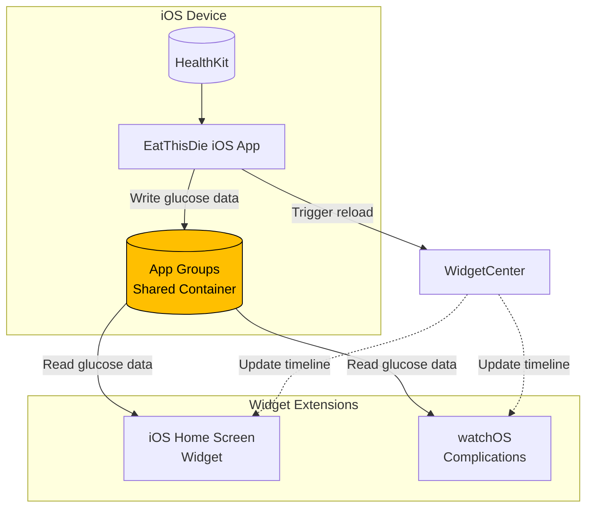

### Widget Families

#### Supported Families

| Family | Platform | Size | Use Case |
|--------|----------|------|----------|
| `.accessoryRectangular` | watchOS | Rectangular | Large complications, full details |
| `.accessoryCircular` | watchOS | Circular | Compact watch face complications |
| `.accessoryInline` | watchOS, iOS | Single line | Lock screen, minimal complications |
| `.systemSmall` | iOS | Home screen | iPhone widget |

#### Visual Specifications

**accessoryRectangular** (Recommended):
- Displays: Value, trend, delta, time
- Layout: Horizontal with emphasis on glucose value
- Example: `145 ↗ +2/min 10:23`

**accessoryCircular**:
- Displays: Value, trend
- Layout: Stacked vertical
- Example: Center `145`, below `↗`

**accessoryInline**:
- Displays: Value and trend only
- Layout: Single line text
- Example: `145 ↗`

### App Groups Setup

#### 1. Configure Entitlements

**iOS App Entitlements** (`App/App.entitlements`):
```xml
<?xml version="1.0" encoding="UTF-8"?>
<!DOCTYPE plist PUBLIC "-//Apple//DTD PLIST 1.0//EN" 
  "http://www.apple.com/DTDs/PropertyList-1.0.dtd">
<plist version="1.0">
<dict>
    <key>com.apple.security.application-groups</key>
    <array>
        <string>group.com.eatthisidie.shared</string>
    </array>
    <key>com.apple.developer.healthkit</key>
    <true/>
</dict>
</plist>
```

**Widget Extension Entitlements** (`Widgets/Widgets.entitlements`):
```xml
<?xml version="1.0" encoding="UTF-8"?>
<!DOCTYPE plist PUBLIC "-//Apple//DTD PLIST 1.0//EN" 
  "http://www.apple.com/DTDs/PropertyList-1.0.dtd">
<plist version="1.0">
<dict>
    <key>com.apple.security.application-groups</key>
    <array>
        <string>group.com.eatthisidie.shared</string>
    </array>
</dict>
</plist>
```

#### 2. Shared Data Model

```swift
import Foundation

// Shared glucose data structure
struct SharedGlucoseData: Codable {
    let value: Int              // mg/dL always
    let unit: GlucoseUnit       // mg/dL or mmol/L
    let trend: GlucoseTrend
    let minuteChange: Double?   // mg/dL per minute
    let timestamp: Date
    let sensorState: String?
    let isStale: Bool           // > 15 minutes old
    
    var displayValue: String {
        switch unit {
        case .mgdL:
            return "\(value) mg/dL"
        case .mmolL:
            let mmol = Double(value) / 18.0
            return String(format: "%.1f mmol/L", mmol)
        }
    }
}

enum GlucoseTrend: String, Codable {
    case rapidlyRising = "⤴"
    case rising = "↗"
    case stable = "→"
    case falling = "↘"
    case rapidlyFalling = "⤵"
    case unknown = "?"
}

enum GlucoseUnit: String, Codable {
    case mgdL = "mg/dL"
    case mmolL = "mmol/L"
}
```

#### 3. Shared UserDefaults Helper

```swift
import Foundation

class SharedGlucoseStorage {
    private static let suiteName = "group.com.eatthisidie.shared"
    private static let glucoseKey = "latestGlucose"
    private static let schemaVersionKey = "schemaVersion"
    private static let currentSchemaVersion = 1
    
    private let userDefaults: UserDefaults
    
    init?() {
        guard let defaults = UserDefaults(suiteName: Self.suiteName) else {
            return nil
        }
        self.userDefaults = defaults
        
        // Check schema version
        let storedVersion = defaults.integer(forKey: Self.schemaVersionKey)
        if storedVersion == 0 {
            defaults.set(Self.currentSchemaVersion, forKey: Self.schemaVersionKey)
        }
    }
    
    // Write glucose data (iOS App only)
    func saveGlucose(_ glucose: SharedGlucoseData) {
        let encoder = JSONEncoder()
        encoder.dateEncodingStrategy = .iso8601
        
        if let encoded = try? encoder.encode(glucose) {
            userDefaults.set(encoded, forKey: Self.glucoseKey)
            userDefaults.synchronize()
        }
    }
    
    // Read glucose data (Widgets & Watch)
    func loadGlucose() -> SharedGlucoseData? {
        guard let data = userDefaults.data(forKey: Self.glucoseKey) else {
            return nil
        }
        
        let decoder = JSONDecoder()
        decoder.dateDecodingStrategy = .iso8601
        
        return try? decoder.decode(SharedGlucoseData.self, from: data)
    }
    
    // Check if data is stale (> 15 minutes)
    func isDataStale() -> Bool {
        guard let glucose = loadGlucose() else { return true }
        return Date().timeIntervalSince(glucose.timestamp) > 15 * 60
    }
}
```

### WidgetKit Implementation

#### 1. Timeline Entry

```swift
import WidgetKit
import SwiftUI

struct GlucoseEntry: TimelineEntry {
    let date: Date
    let glucose: SharedGlucoseData?
    let configuration: GlucoseWidgetConfiguration?
}

struct GlucoseWidgetConfiguration {
    let showDelta: Bool
    let showTime: Bool
    let alarmThresholds: (low: Int, high: Int)
}
```

#### 2. Timeline Provider

```swift
struct GlucoseTimelineProvider: TimelineProvider {
    private let storage = SharedGlucoseStorage()
    
    func placeholder(in context: Context) -> GlucoseEntry {
        GlucoseEntry(
            date: Date(),
            glucose: SharedGlucoseData(
                value: 120,
                unit: .mgdL,
                trend: .stable,
                minuteChange: 0,
                timestamp: Date(),
                sensorState: "Active",
                isStale: false
            ),
            configuration: nil
        )
    }
    
    func getSnapshot(in context: Context, completion: @escaping (GlucoseEntry) -> Void) {
        let glucose = storage?.loadGlucose()
        let entry = GlucoseEntry(date: Date(), glucose: glucose, configuration: nil)
        completion(entry)
    }
    
    func getTimeline(in context: Context, completion: @escaping (Timeline<GlucoseEntry>) -> Void) {
        let glucose = storage?.loadGlucose()
        let currentDate = Date()
        
        // Create entry for current glucose
        let entry = GlucoseEntry(
            date: currentDate,
            glucose: glucose,
            configuration: nil
        )
        
        // Schedule next refresh in 5 minutes
        // (CGM readings typically come every 1-5 minutes)
        let nextUpdate = Calendar.current.date(
            byAdding: .minute,
            value: 5,
            to: currentDate
        )!
        
        let timeline = Timeline(entries: [entry], policy: .after(nextUpdate))
        completion(timeline)
    }
}
```

#### 3. Widget Views with DOS Amber CGA Aesthetic

```swift
struct GlucoseWidgetView: View {
    @Environment(\.widgetFamily) var family
    let entry: GlucoseEntry
    
    // DOS Amber CGA colors
    private let amberColor = Color(hex: 0xFFBF00)
    private let backgroundColor = Color(hex: 0x0A0A0A)
    
    var body: some View {
        switch family {
        case .accessoryRectangular:
            rectangularView
        case .accessoryCircular:
            circularView
        case .accessoryInline:
            inlineView
        case .systemSmall:
            systemSmallView
        default:
            Text("Unsupported")
        }
    }
    
    private var rectangularView: some View {
        HStack(alignment: .lastTextBaseline, spacing: 8) {
            if let glucose = entry.glucose {
                // Large glucose value
                Text("\(glucose.value)")
                    .font(.system(size: 32, design: .monospaced))
                    .fontWeight(.bold)
                    .widgetAccentable()
                
                VStack(alignment: .leading, spacing: 2) {
                    // Trend arrow
                    Text(glucose.trend.rawValue)
                        .font(.system(size: 16))
                    
                    // Minute change
                    if let delta = glucose.minuteChange {
                        Text(String(format: "%+.1f", delta))
                            .font(.system(size: 10, design: .monospaced))
                            .opacity(0.8)
                    }
                    
                    // Timestamp
                    Text(glucose.timestamp, style: .time)
                        .font(.system(size: 10, design: .monospaced))
                        .opacity(0.6)
                }
            } else {
                Text("---")
                    .font(.system(size: 32, design: .monospaced))
            }
        }
        .frame(maxWidth: .infinity, maxHeight: .infinity)
    }
    
    private var circularView: some View {
        VStack(spacing: 2) {
            if let glucose = entry.glucose {
                Text("\(glucose.value)")
                    .font(.system(size: 24, design: .monospaced))
                    .fontWeight(.bold)
                    .widgetAccentable()
                
                Text(glucose.trend.rawValue)
                    .font(.system(size: 14))
            } else {
                Text("---")
                    .font(.system(size: 24, design: .monospaced))
            }
        }
    }
    
    private var inlineView: some View {
        if let glucose = entry.glucose {
            Text("\(glucose.value) \(glucose.trend.rawValue)")
                .font(.system(design: .monospaced))
        } else {
            Text("--- ?")
        }
    }
    
    private var systemSmallView: some View {
        ZStack {
            backgroundColor
            
            VStack(spacing: 12) {
                // DOS-style header
                Text("GLUCOSE.SYS")
                    .font(.system(size: 10, design: .monospaced))
                    .foregroundColor(amberColor)
                    .opacity(0.6)
                
                if let glucose = entry.glucose {
                    // Main value
                    HStack(alignment: .lastTextBaseline, spacing: 8) {
                        Text("\(glucose.value)")
                            .font(.system(size: 48, design: .monospaced))
                            .fontWeight(.bold)
                            .foregroundColor(amberColor)
                        
                        VStack(alignment: .leading) {
                            Text(glucose.trend.rawValue)
                                .font(.system(size: 20))
                                .foregroundColor(amberColor)
                            
                            if let delta = glucose.minuteChange {
                                Text(String(format: "%+.1f", delta))
                                    .font(.system(size: 12, design: .monospaced))
                                    .foregroundColor(amberColor)
                                    .opacity(0.7)
                            }
                        }
                    }
                    
                    // Timestamp
                    Text(glucose.timestamp, style: .time)
                        .font(.system(size: 12, design: .monospaced))
                        .foregroundColor(amberColor)
                        .opacity(0.5)
                } else {
                    Text("NO DATA")
                        .font(.system(size: 20, design: .monospaced))
                        .foregroundColor(amberColor)
                }
            }
            .padding()
        }
    }
}
```

#### 4. Widget Definition

```swift
@main
struct GlucoseWidget: Widget {
    let kind: String = "GlucoseWidget"
    
    var body: some WidgetConfiguration {
        StaticConfiguration(
            kind: kind,
            provider: GlucoseTimelineProvider()
        ) { entry in
            GlucoseWidgetView(entry: entry)
        }
        .configurationDisplayName("Glucose Monitor")
        .description("Displays current glucose reading with trend")
        .supportedFamilies([
            .accessoryRectangular,
            .accessoryCircular,
            .accessoryInline,
            .systemSmall
        ])
    }
}
```

### Widget Refresh Triggers

```swift
import WidgetKit

class WidgetRefreshManager {
    static let shared = WidgetRefreshManager()
    
    func reloadAllWidgets() {
        WidgetCenter.shared.reloadAllTimelines()
    }
    
    func reloadGlucoseWidgets() {
        WidgetCenter.shared.reloadTimelines(ofKind: "GlucoseWidget")
    }
    
    // Call from iOS app after writing new glucose data
    func notifyGlucoseUpdate() {
        reloadGlucoseWidgets()
    }
}

// In iOS app, after saving to shared container:
func handleNewGlucoseReading(_ glucose: SensorGlucose) {
    // 1. Save to HealthKit
    healthKitManager.saveGlucose(glucose)
    
    // 2. Save to shared container
    let sharedData = SharedGlucoseData(from: glucose)
    sharedStorage.saveGlucose(sharedData)
    
    // 3. Trigger widget reload
    WidgetRefreshManager.shared.notifyGlucoseUpdate()
}
```

### Live Activities (iOS 16.1+)

For **Dynamic Island and Lock Screen** persistent glucose display:

```swift
import ActivityKit

@available(iOS 16.1, *)
struct GlucoseActivityAttributes: ActivityAttributes {
    public struct ContentState: Codable, Hashable {
        let value: Int
        let trend: String
        let timestamp: Date
        let isAlarm: Bool
    }
    
    // Static data that doesn't change
    let unit: GlucoseUnit
}

@available(iOS 16.1, *)
class GlucoseLiveActivityManager {
    private var activity: Activity<GlucoseActivityAttributes>?
    
    func startActivity(glucose: SharedGlucoseData) async throws {
        let attributes = GlucoseActivityAttributes(unit: glucose.unit)
        let initialState = GlucoseActivityAttributes.ContentState(
            value: glucose.value,
            trend: glucose.trend.rawValue,
            timestamp: glucose.timestamp,
            isAlarm: false
        )
        
        activity = try Activity<GlucoseActivityAttributes>.request(
            attributes: attributes,
            contentState: initialState,
            pushType: nil
        )
    }
    
    func updateActivity(glucose: SharedGlucoseData, isAlarm: Bool) async {
        guard let activity = activity else { return }
        
        let newState = GlucoseActivityAttributes.ContentState(
            value: glucose.value,
            trend: glucose.trend.rawValue,
            timestamp: glucose.timestamp,
            isAlarm: isAlarm
        )
        
        await activity.update(using: newState)
    }
    
    func stopActivity() async {
        guard let activity = activity else { return }
        await activity.end(dismissalPolicy: .immediate)
    }
}
```

### Pros and Cons

#### Pros ✓
- **Native Experience**: Full control over UI and branding
- **DOS Amber CGA**: Can implement custom design system
- **Multiple Families**: Support various complication sizes
- **Better Updates**: Direct control over refresh timing
- **iOS Widgets**: Bonus home screen widgets
- **Live Activities**: Dynamic Island support
- **Professional**: Production-quality UX

#### Cons ✗
- **More Complex**: Requires WidgetKit knowledge
- **App Groups Setup**: Additional configuration
- **Limited Interactivity**: Widgets are read-only (no taps)
- **Background Limits**: iOS restricts update frequency
- **Development Time**: 2-3 weeks implementation

### Best For

- **Phase 2 Implementation**: Post-MVP enhancement
- **Branding**: Maintain DOS amber CGA aesthetic
- **Professional Apps**: Production-ready user experience
- **iOS + Watch**: Unified widget experience

---

## Full watchOS App Architecture

### Overview

A **full native watchOS app** provides the most comprehensive Apple Watch experience, including:
- Custom branded UI with DOS amber CGA aesthetic
- Interactive glucose monitoring
- Quick food logging via voice and Siri
- Background glucose updates
- Advanced complications
- Offline capability

### Architecture Overview

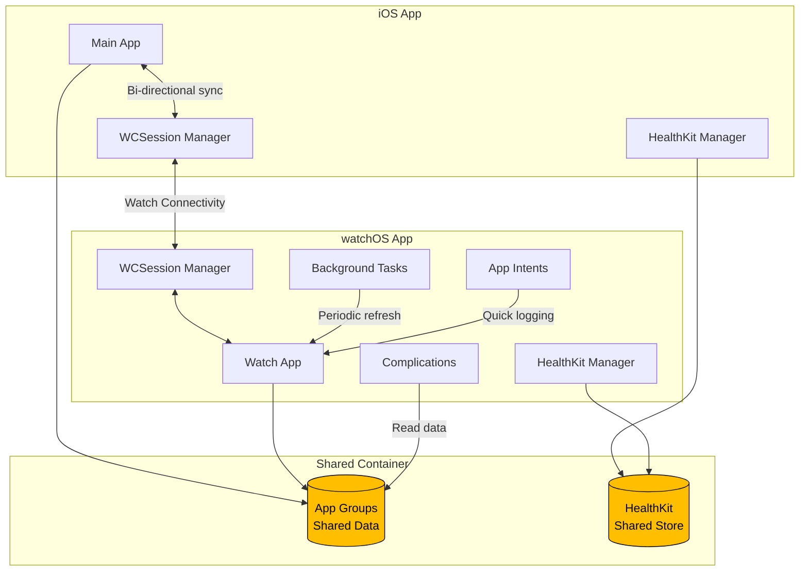

### Watch Connectivity (WCSession)

#### Data Transfer Strategies

| Method | Use Case | Latency | Data Size | Battery Impact |
|--------|----------|---------|-----------|----------------|
| **Application Context** | Current glucose state | Low | < 1 KB | Minimal |
| **User Info Transfer** | Historical data batch | Medium | < 10 KB | Low |
| **File Transfer** | Full history export | High | Any | Medium |
| **Message (reachable)** | Real-time alerts | Immediate | < 64 KB | High |

#### Implementation

```swift
import WatchConnectivity

class WatchConnectivityManager: NSObject, ObservableObject {
    static let shared = WatchConnectivityManager()
    
    private let session: WCSession? = WCSession.isSupported() ? WCSession.default : nil
    
    @Published var isReachable = false
    @Published var isActivated = false
    
    override init() {
        super.init()
        session?.delegate = self
        session?.activate()
    }
    
    // Send current glucose via Application Context (automatic delivery)
    func sendCurrentGlucose(_ glucose: SharedGlucoseData) {
        guard let session = session, session.isActivationAllowed else { return }
        
        let encoder = JSONEncoder()
        encoder.dateEncodingStrategy = .iso8601
        
        guard let data = try? encoder.encode(glucose),
              let dict = try? JSONSerialization.jsonObject(with: data) as? [String: Any] else {
            return
        }
        
        do {
            try session.updateApplicationContext(dict)
        } catch {
            print("Failed to send application context: \(error)")
        }
    }
    
    // Send historical data batch via User Info Transfer (queued)
    func sendHistoricalData(_ history: [SharedGlucoseData]) {
        guard let session = session else { return }
        
        let encoder = JSONEncoder()
        encoder.dateEncodingStrategy = .iso8601
        
        let historyData = history.compactMap { glucose -> [String: Any]? in
            guard let data = try? encoder.encode(glucose),
                  let dict = try? JSONSerialization.jsonObject(with: data) as? [String: Any] else {
                return nil
            }
            return dict
        }
        
        session.transferUserInfo(["history": historyData])
    }
    
    // Send real-time alert via Message (requires reachability)
    func sendAlert(message: String) {
        guard let session = session, session.isReachable else { return }
        
        session.sendMessage(
            ["alert": message],
            replyHandler: nil,
            errorHandler: { error in
                print("Failed to send message: \(error)")
            }
        )
    }
}

extension WatchConnectivityManager: WCSessionDelegate {
    func session(
        _ session: WCSession,
        activationDidCompleteWith activationState: WCSessionActivationState,
        error: Error?
    ) {
        DispatchQueue.main.async {
            self.isActivated = activationState == .activated
        }
    }
    
    func sessionReachabilityDidChange(_ session: WCSession) {
        DispatchQueue.main.async {
            self.isReachable = session.isReachable
        }
    }
    
    // Receive application context updates on watch
    func session(
        _ session: WCSession,
        didReceiveApplicationContext applicationContext: [String: Any]
    ) {
        guard let data = try? JSONSerialization.data(withJSONObject: applicationContext),
              let glucose = try? JSONDecoder().decode(SharedGlucoseData.self, from: data) else {
            return
        }
        
        // Update local storage
        DispatchQueue.main.async {
            SharedGlucoseStorage()?.saveGlucose(glucose)
            WidgetRefreshManager.shared.reloadAllWidgets()
        }
    }
    
    #if os(iOS)
    func sessionDidBecomeInactive(_ session: WCSession) {}
    func sessionDidDeactivate(_ session: WCSession) {
        session.activate()
    }
    #endif
}
```

### watchOS Background Updates

#### HealthKit Observer Query

```swift
import HealthKit

class WatchHealthKitManager {
    private let healthStore = HKHealthStore()
    private var observerQuery: HKObserverQuery?
    
    func setupBackgroundDelivery() {
        guard HKHealthStore.isHealthDataAvailable() else { return }
        
        let glucoseType = HKQuantityType.quantityType(forIdentifier: .bloodGlucose)!
        
        // Enable background delivery
        healthStore.enableBackgroundDelivery(
            for: glucoseType,
            frequency: .immediate
        ) { success, error in
            if success {
                self.startObserverQuery(for: glucoseType)
            }
        }
    }
    
    private func startObserverQuery(for type: HKQuantityType) {
        observerQuery = HKObserverQuery(sampleType: type, predicate: nil) { 
            [weak self] query, completionHandler, error in
            
            guard error == nil else {
                completionHandler()
                return
            }
            
            // Fetch latest glucose
            self?.fetchLatestGlucose { glucose in
                // Update shared storage
                if let glucose = glucose {
                    SharedGlucoseStorage()?.saveGlucose(glucose)
                    WidgetRefreshManager.shared.reloadAllWidgets()
                }
                
                // Schedule background refresh
                self?.scheduleBackgroundRefresh()
                
                completionHandler()
            }
        }
        
        healthStore.execute(observerQuery!)
    }
    
    private func fetchLatestGlucose(completion: @escaping (SharedGlucoseData?) -> Void) {
        let glucoseType = HKQuantityType.quantityType(forIdentifier: .bloodGlucose)!
        let sortDescriptor = NSSortDescriptor(key: HKSampleSortIdentifierStartDate, ascending: false)
        
        let query = HKSampleQuery(
            sampleType: glucoseType,
            predicate: nil,
            limit: 1,
            sortDescriptors: [sortDescriptor]
        ) { _, samples, error in
            guard let sample = samples?.first as? HKQuantitySample else {
                completion(nil)
                return
            }
            
            let value = Int(sample.quantity.doubleValue(for: .milligramsPerDeciliter))
            let glucose = SharedGlucoseData(
                value: value,
                unit: .mgdL,
                trend: .stable, // TODO: Calculate from recent samples
                minuteChange: nil,
                timestamp: sample.startDate,
                sensorState: "Active",
                isStale: false
            )
            
            completion(glucose)
        }
        
        healthStore.execute(query)
    }
}
```

#### WKRefreshBackgroundTask

```swift
import WatchKit

class ExtensionDelegate: NSObject, WKExtensionDelegate {
    func handle(_ backgroundTasks: Set<WKRefreshBackgroundTask>) {
        for task in backgroundTasks {
            switch task {
            case let backgroundTask as WKApplicationRefreshBackgroundTask:
                handleAppRefresh(backgroundTask)
                
            case let snapshotTask as WKSnapshotRefreshBackgroundTask:
                handleSnapshotRefresh(snapshotTask)
                
            default:
                task.setTaskCompletedWithSnapshot(false)
            }
        }
    }
    
    private func handleAppRefresh(_ task: WKApplicationRefreshBackgroundTask) {
        // Fetch latest glucose data
        WatchHealthKitManager().fetchLatestGlucose { glucose in
            if let glucose = glucose {
                SharedGlucoseStorage()?.saveGlucose(glucose)
                WidgetRefreshManager.shared.reloadAllWidgets()
            }
            
            // Schedule next refresh in 15 minutes
            self.scheduleBackgroundRefresh(in: 15 * 60)
            
            task.setTaskCompletedWithSnapshot(false)
        }
    }
    
    private func handleSnapshotRefresh(_ task: WKSnapshotRefreshBackgroundTask) {
        // Perform minimal updates for snapshot
        task.setTaskCompleted(
            restoredDefaultState: true,
            estimatedSnapshotExpiration: Date(timeIntervalSinceNow: 15 * 60),
            userInfo: nil
        )
    }
    
    private func scheduleBackgroundRefresh(in seconds: TimeInterval) {
        let fireDate = Date(timeIntervalSinceNow: seconds)
        
        WKExtension.shared().scheduleBackgroundRefresh(
            withPreferredDate: fireDate,
            userInfo: nil
        ) { error in
            if let error = error {
                print("Failed to schedule background refresh: \(error)")
            }
        }
    }
}
```

### watchOS SwiftUI Interface (DOS Amber CGA)

#### Main Glucose View

```swift
import SwiftUI

struct WatchMainView: View {
    @StateObject private var storage = WatchViewModel()
    
    // DOS Amber CGA colors
    private let amberColor = Color(hex: 0xFFBF00)
    private let backgroundColor = Color(hex: 0x0A0A0A)
    
    var body: some View {
        ScrollView {
            VStack(spacing: 16) {
                // Header
                dosHeader
                
                // Main glucose display
                if let glucose = storage.currentGlucose {
                    glucoseDisplay(glucose)
                    trendDisplay(glucose)
                    statusBar(glucose)
                } else {
                    noDataDisplay
                }
                
                // Quick actions
                quickActions
            }
            .padding()
        }
        .background(backgroundColor)
        .foregroundColor(amberColor)
    }
    
    private var dosHeader: some View {
        HStack {
            Text("GLUCOSE.SYS")
                .font(.system(size: 12, design: .monospaced))
                .opacity(0.6)
            
            Spacer()
            
            Text(Date(), style: .time)
                .font(.system(size: 12, design: .monospaced))
                .opacity(0.6)
        }
    }
    
    private func glucoseDisplay(_ glucose: SharedGlucoseData) -> some View {
        VStack(spacing: 8) {
            // Large glucose value
            HStack(alignment: .lastTextBaseline, spacing: 12) {
                Text("\(glucose.value)")
                    .font(.system(size: 64, design: .monospaced))
                    .fontWeight(.bold)
                
                Text(glucose.trend.rawValue)
                    .font(.system(size: 32))
            }
            
            // Unit
            Text(glucose.unit.rawValue)
                .font(.system(size: 14, design: .monospaced))
                .opacity(0.6)
        }
        .padding(.vertical)
    }
    
    private func trendDisplay(_ glucose: SharedGlucoseData) -> some View {
        HStack(spacing: 20) {
            // Minute change
            if let delta = glucose.minuteChange {
                VStack {
                    Text(String(format: "%+.1f", delta))
                        .font(.system(size: 20, design: .monospaced))
                        .fontWeight(.semibold)
                    Text("/min")
                        .font(.system(size: 10, design: .monospaced))
                        .opacity(0.6)
                }
            }
            
            // Time ago
            VStack {
                Text(timeAgo(glucose.timestamp))
                    .font(.system(size: 20, design: .monospaced))
                    .fontWeight(.semibold)
                Text("ago")
                    .font(.system(size: 10, design: .monospaced))
                    .opacity(0.6)
            }
        }
        .padding()
        .overlay(
            RoundedRectangle(cornerRadius: 0)
                .stroke(amberColor.opacity(0.3), lineWidth: 1)
        )
    }
    
    private func statusBar(_ glucose: SharedGlucoseData) -> some View {
        HStack {
            // Sensor state indicator
            Circle()
                .fill(glucose.isStale ? Color.red : amberColor)
                .frame(width: 8, height: 8)
            
            Text(glucose.isStale ? "STALE" : "ACTIVE")
                .font(.system(size: 10, design: .monospaced))
            
            Spacer()
            
            // Last update
            Text(glucose.timestamp, style: .time)
                .font(.system(size: 10, design: .monospaced))
        }
        .padding(.horizontal)
        .opacity(0.7)
    }
    
    private var noDataDisplay: some View {
        VStack(spacing: 16) {
            Text("NO DATA")
                .font(.system(size: 24, design: .monospaced))
                .fontWeight(.bold)
            
            Text("Check iPhone app")
                .font(.system(size: 12, design: .monospaced))
                .opacity(0.6)
        }
        .padding(.vertical, 40)
    }
    
    private var quickActions: some View {
        VStack(spacing: 12) {
            actionButton(icon: "fork.knife", title: "LOG FOOD") {
                // Navigate to food logging
            }
            
            actionButton(icon: "chart.line.uptrend.xyaxis", title: "HISTORY") {
                // Navigate to history view
            }
        }
    }
    
    private func actionButton(icon: String, title: String, action: @escaping () -> Void) -> some View {
        Button(action: action) {
            HStack {
                Image(systemName: icon)
                    .font(.system(size: 16))
                Text(title)
                    .font(.system(size: 14, design: .monospaced))
                    .fontWeight(.semibold)
                Spacer()
            }
            .padding()
            .background(amberColor.opacity(0.1))
            .overlay(
                RoundedRectangle(cornerRadius: 0)
                    .stroke(amberColor, lineWidth: 1)
            )
        }
        .buttonStyle(PlainButtonStyle())
    }
    
    private func timeAgo(_ date: Date) -> String {
        let seconds = Int(Date().timeIntervalSince(date))
        let minutes = seconds / 60
        
        if minutes < 1 {
            return "< 1m"
        } else if minutes < 60 {
            return "\(minutes)m"
        } else {
            return "\(minutes / 60)h"
        }
    }
}

// ViewModel
class WatchViewModel: ObservableObject {
    @Published var currentGlucose: SharedGlucoseData?
    
    private let storage = SharedGlucoseStorage()
    private var timer: Timer?
    
    init() {
        loadGlucose()
        startPeriodicRefresh()
    }
    
    private func loadGlucose() {
        currentGlucose = storage?.loadGlucose()
    }
    
    private func startPeriodicRefresh() {
        timer = Timer.scheduledTimer(withTimeInterval: 60, repeats: true) { [weak self] _ in
            self?.loadGlucose()
        }
    }
}
```

#### Sparkline Chart View

```swift
struct GlucoseSparklineView: View {
    let history: [SharedGlucoseData]
    let amberColor = Color(hex: 0xFFBF00)
    
    var body: some View {
        GeometryReader { geometry in
            Path { path in
                guard !history.isEmpty else { return }
                
                let maxValue = history.map { $0.value }.max() ?? 200
                let minValue = history.map { $0.value }.min() ?? 80
                let range = maxValue - minValue
                
                let width = geometry.size.width
                let height = geometry.size.height
                let stepX = width / CGFloat(history.count - 1)
                
                for (index, glucose) in history.enumerated() {
                    let x = CGFloat(index) * stepX
                    let normalizedValue = CGFloat(glucose.value - minValue) / CGFloat(range)
                    let y = height - (normalizedValue * height)
                    
                    if index == 0 {
                        path.move(to: CGPoint(x: x, y: y))
                    } else {
                        path.addLine(to: CGPoint(x: x, y: y))
                    }
                }
            }
            .stroke(amberColor, lineWidth: 2)
        }
        .frame(height: 60)
    }
}
```

### Quick Food Logging with App Intents

```swift
import AppIntents

@available(iOS 16.0, watchOS 9.0, *)
struct LogFoodIntent: AppIntent {
    static var title: LocalizedStringResource = "Log Food"
    static var description = IntentDescription("Quickly log food intake")
    
    @Parameter(title: "Food Name")
    var foodName: String
    
    @Parameter(title: "Carbs (grams)", default: 0)
    var carbs: Int
    
    func perform() async throws -> some IntentResult {
        // Log food with current glucose snapshot
        let glucose = SharedGlucoseStorage()?.loadGlucose()
        
        let entry = FoodLogEntry(
            name: foodName,
            carbs: carbs,
            timestamp: Date(),
            glucoseAtTime: glucose?.value
        )
        
        // Save to shared container for iOS app to sync
        FoodLogStorage.shared.append(entry)
        
        return .result(dialog: "Logged \(foodName) with \(carbs)g carbs")
    }
}

// Siri shortcut registration
@available(iOS 16.0, watchOS 9.0, *)
struct FoodLoggingShortcuts: AppShortcutsProvider {
    static var appShortcuts: [AppShortcut] {
        AppShortcut(
            intent: LogFoodIntent(),
            phrases: [
                "Log food with \(.applicationName)",
                "I ate \(.foodName) with \(.applicationName)"
            ],
            shortTitle: "Log Food",
            systemImageName: "fork.knife"
        )
    }
}
```

### Complications (WidgetKit-based)

watchOS 9+ uses the same WidgetKit approach detailed in the Native Widget section. Reuse the same TimelineProvider and views.

### Offline Capability

```swift
class WatchOfflineStorage {
    private let maxCachedReadings = 100
    private let cacheKey = "offlineGlucoseCache"
    
    func cacheReading(_ glucose: SharedGlucoseData) {
        var cache = loadCache()
        cache.append(glucose)
        
        // Keep only recent readings
        if cache.count > maxCachedReadings {
            cache.removeFirst(cache.count - maxCachedReadings)
        }
        
        saveCache(cache)
    }
    
    func loadCache() -> [SharedGlucoseData] {
        guard let data = UserDefaults.standard.data(forKey: cacheKey) else {
            return []
        }
        return (try? JSONDecoder().decode([SharedGlucoseData].self, from: data)) ?? []
    }
    
    private func saveCache(_ cache: [SharedGlucoseData]) {
        if let data = try? JSONEncoder().encode(cache) {
            UserDefaults.standard.set(data, forKey: cacheKey)
        }
    }
    
    func syncWithPhone() {
        let cache = loadCache()
        WatchConnectivityManager.shared.sendHistoricalData(cache)
        
        // Clear cache after successful sync
        UserDefaults.standard.removeObject(forKey: cacheKey)
    }
}
```

### Pros and Cons

#### Pros ✓
- **Full Control**: Complete UX customization
- **Interactive**: Tap navigation, scrolling, buttons
- **DOS Amber CGA**: Perfect aesthetic implementation
- **Food Logging**: Voice-activated quick logging
- **Offline**: Works when phone unavailable
- **Background**: Automatic glucose updates
- **Professional**: Best-in-class user experience

#### Cons ✗
- **Most Complex**: Significant development effort
- **Maintenance**: Ongoing updates and bug fixes
- **Battery**: Background processing impacts battery
- **Testing**: Requires physical watch for QA
- **Watch Connectivity**: Complex synchronization logic
- **Timeline**: 4-6 weeks development

### Best For

- **Phase 3**: Long-term product vision
- **Power Users**: Advanced features and customization
- **Standalone**: Watch-first users who don't always have phone
- **Complete Platform**: Full iOS + watchOS ecosystem

---

## Recommended Implementation Strategy

### Phased Rollout Approach

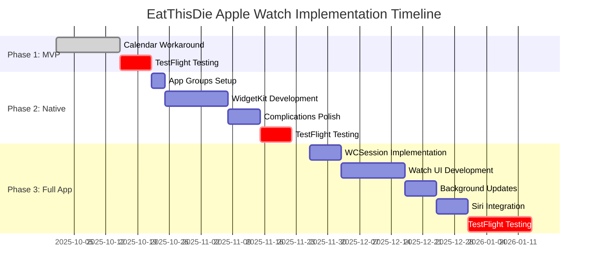

### Phase 1: Calendar Workaround MVP (1-2 weeks)

**Goal:** Provide basic Apple Watch glucose display with minimal development effort.

**Deliverables:**
- EventKit calendar integration
- Glucose event creation with trend arrows
- Auto-cleanup mechanism
- User settings for calendar selection
- Documentation for TestFlight users

**Implementation Checklist:**
- [ ] Add EventKit permission request
- [ ] Implement calendar selection UI
- [ ] Create glucose event formatter
- [ ] Implement auto-cleanup job
- [ ] Add debouncing logic (5-minute minimum)
- [ ] Test on multiple watch faces
- [ ] Create user documentation

**Success Criteria:**
- Glucose visible on watch within 1-2 minutes of update
- Events auto-delete after 24 hours
- No calendar clutter (< 10 events at any time)
- Works on 5+ different watch face complications

**Risks & Mitigations:**

| Risk | Impact | Mitigation |
|------|--------|-----------|
| Calendar sync delays | Medium | Document expected 1-2 min latency |
| User calendar clutter | High | Recommend dedicated calendar, clear cleanup |
| Permission denial | High | Graceful fallback, clear UX explanation |

### Phase 2: Native Widgets & Complications (2-3 weeks)

**Goal:** Professional-grade complications with DOS amber CGA branding.

**Deliverables:**
- App Groups shared container
- WidgetKit complications for watchOS
- iOS home screen widgets
- Live Activities (Dynamic Island)
- DOS amber CGA styled complications

**Implementation Checklist:**
- [ ] Configure App Groups entitlements
- [ ] Create shared data models
- [ ] Implement SharedGlucoseStorage helper
- [ ] Build TimelineProvider
- [ ] Design widget views for all families
- [ ] Implement DOS amber CGA styling
- [ ] Add widget refresh triggers
- [ ] Test complication families
- [ ] Live Activities implementation (iOS 16.1+)

**Success Criteria:**
- Complications display on watch within 30 seconds
- DOS amber aesthetic maintained across all sizes
- Widgets update automatically via background delivery
- Battery impact < 3% per day

**Risks & Mitigations:**

| Risk | Impact | Mitigation |
|------|--------|-----------|
| Background update limits | Medium | Use efficient HKObserverQuery |
| Widget budget exhaustion | High | Implement smart refresh throttling |
| Design inconsistency | Medium | Create shared design tokens |

### Phase 3: Full watchOS App (4-6 weeks)

**Goal:** Standalone watch experience with food logging and offline support.

**Deliverables:**
- Native watchOS app with SwiftUI
- Watch Connectivity bi-directional sync
- Background glucose updates via HealthKit
- Quick food logging with Siri
- Offline data caching
- Advanced complications

**Implementation Checklist:**
- [ ] Create watchOS app target
- [ ] Implement WCSession manager
- [ ] Build main glucose view (DOS aesthetic)
- [ ] Implement sparkline chart
- [ ] Add food logging UI
- [ ] Create App Intents for Siri
- [ ] Implement background refresh
- [ ] Add offline storage
- [ ] HealthKit background delivery
- [ ] Comprehensive testing

**Success Criteria:**
- Watch app functions offline for 24+ hours
- Food logging via Siri < 10 seconds
- Background updates every 5 minutes when active
- Battery impact < 5% per day
- Full DOS amber CGA aesthetic

**Risks & Mitigations:**

| Risk | Impact | Mitigation |
|------|--------|-----------|
| Complex synchronization bugs | High | Extensive testing, conflict resolution |
| Battery drain | High | Profile and optimize background tasks |
| Watch Connectivity failures | Medium | Robust error handling, retry logic |
| Siri integration issues | Medium | Fallback manual logging |

### Integration with Existing Architecture

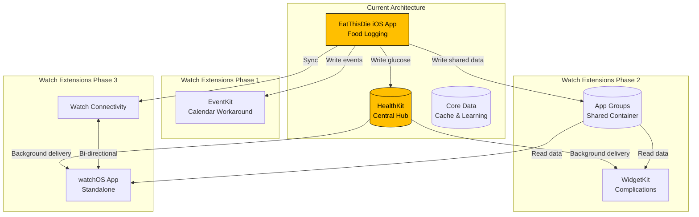

### Resource Requirements

#### Development Team

| Phase | iOS Developer | watchOS Specialist | Designer | QA |
|-------|--------------|-------------------|----------|-----|
| Phase 1 | 1 FTE | - | 0.25 FTE | 0.5 FTE |
| Phase 2 | 1 FTE | 0.5 FTE | 0.5 FTE | 0.5 FTE |
| Phase 3 | 1 FTE | 1 FTE | 0.5 FTE | 1 FTE |

#### Hardware Requirements
- iPhone 12+ running iOS 16+
- Apple Watch Series 6+ running watchOS 9+
- Multiple watch models for QA (SE, Series 8, Ultra)

#### Third-Party Dependencies
- None (all native Apple frameworks)

### Decision Matrix

Use this matrix to decide which phase to implement:

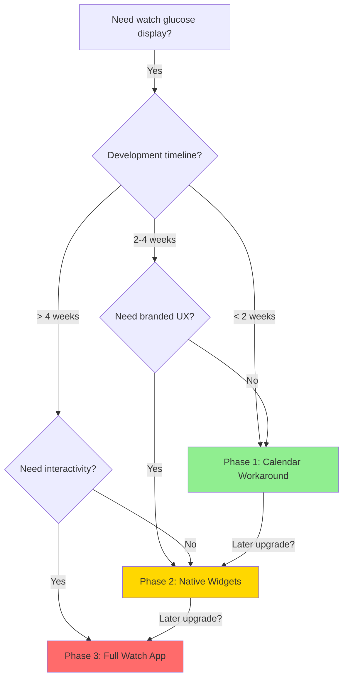

---

## Technical Implementation Guides

### EventKit: Calendar Access and Management

#### Request Access

```swift
import EventKit

func requestCalendarAccess() async throws -> Bool {
    let eventStore = EKEventStore()
    
    if #available(iOS 17.0, *) {
        return try await eventStore.requestFullAccessToEvents()
    } else {
        return try await eventStore.requestAccess(to: .event)
    }
}
```

#### Create or Find Dedicated Calendar

```swift
func findOrCreateGlucoseCalendar() -> EKCalendar? {
    let eventStore = EKEventStore()
    
    // Try to find existing calendar
    if let existing = eventStore.calendars(for: .event)
        .first(where: { $0.title == "Glucose" }) {
        return existing
    }
    
    // Create new calendar
    let calendar = EKCalendar(for: .event, eventStore: eventStore)
    calendar.title = "Glucose"
    calendar.cgColor = UIColor(hex: 0xFFBF00).cgColor // Amber
    
    // Find default source (iCloud or local)
    calendar.source = eventStore.defaultCalendarForNewEvents?.source
        ?? eventStore.sources.first(where: { $0.sourceType == .calDAV })
        ?? eventStore.sources.first(where: { $0.sourceType == .local })
    
    do {
        try eventStore.saveCalendar(calendar, commit: true)
        return calendar
    } catch {
        print("Failed to create calendar: \(error)")
        return nil
    }
}
```

### WidgetKit: Complete Timeline Provider

```swift
import WidgetKit
import SwiftUI

struct GlucoseTimelineProvider: TimelineProvider {
    typealias Entry = GlucoseEntry
    
    func placeholder(in context: Context) -> GlucoseEntry {
        GlucoseEntry(
            date: Date(),
            glucose: SharedGlucoseData(
                value: 120,
                unit: .mgdL,
                trend: .stable,
                minuteChange: 0,
                timestamp: Date(),
                sensorState: "Active",
                isStale: false
            ),
            configuration: nil
        )
    }
    
    func getSnapshot(in context: Context, completion: @escaping (GlucoseEntry) -> Void) {
        let entry: GlucoseEntry
        
        if context.isPreview {
            entry = placeholder(in: context)
        } else {
            let glucose = SharedGlucoseStorage()?.loadGlucose()
            entry = GlucoseEntry(date: Date(), glucose: glucose, configuration: nil)
        }
        
        completion(entry)
    }
    
    func getTimeline(in context: Context, completion: @escaping (Timeline<GlucoseEntry>) -> Void) {
        let currentDate = Date()
        let storage = SharedGlucoseStorage()
        let glucose = storage?.loadGlucose()
        
        // Create current entry
        let entry = GlucoseEntry(
            date: currentDate,
            glucose: glucose,
            configuration: nil
        )
        
        // Determine next refresh
        let nextRefresh: Date
        if let glucose = glucose, !glucose.isStale {
            // Refresh in 5 minutes for active data
            nextRefresh = Calendar.current.date(
                byAdding: .minute,
                value: 5,
                to: currentDate
            )!
        } else {
            // Refresh in 1 minute for stale/missing data
            nextRefresh = Calendar.current.date(
                byAdding: .minute,
                value: 1,
                to: currentDate
            )!
        }
        
        let timeline = Timeline(entries: [entry], policy: .after(nextRefresh))
        completion(timeline)
    }
}
```

### App Groups: Shared Container Setup

#### 1. Enable App Groups Capability

```bash
# In Xcode:
# 1. Select your target (iOS App, Widget Extension, Watch App)
# 2. Go to "Signing & Capabilities"
# 3. Click "+ Capability" and add "App Groups"
# 4. Add identifier: group.com.eatthisidie.shared
# 5. Repeat for all targets
```

#### 2. Shared Storage Helper

```swift
import Foundation

class SharedStorage {
    static let suiteName = "group.com.eatthisidie.shared"
    private let defaults: UserDefaults
    
    init?() {
        guard let userDefaults = UserDefaults(suiteName: Self.suiteName) else {
            return nil
        }
        self.defaults = userDefaults
    }
    
    // Generic get/set with Codable
    func save<T: Codable>(_ value: T, forKey key: String) {
        let encoder = JSONEncoder()
        encoder.dateEncodingStrategy = .iso8601
        
        if let encoded = try? encoder.encode(value) {
            defaults.set(encoded, forKey: key)
            defaults.synchronize()
        }
    }
    
    func load<T: Codable>(forKey key: String, as type: T.Type) -> T? {
        guard let data = defaults.data(forKey: key) else {
            return nil
        }
        
        let decoder = JSONDecoder()
        decoder.dateDecodingStrategy = .iso8601
        
        return try? decoder.decode(T.self, from: data)
    }
    
    func remove(forKey key: String) {
        defaults.removeObject(forKey: key)
        defaults.synchronize()
    }
}
```

### HealthKit: Background Delivery Setup

#### iOS App Setup

```swift
import HealthKit

class HealthKitBackgroundManager {
    private let healthStore = HKHealthStore()
    
    func enableBackgroundDelivery() {
        guard HKHealthStore.isHealthDataAvailable() else { return }
        
        let glucoseType = HKQuantityType.quantityType(forIdentifier: .bloodGlucose)!
        
        // Enable background delivery with immediate frequency
        healthStore.enableBackgroundDelivery(
            for: glucoseType,
            frequency: .immediate
        ) { success, error in
            if success {
                print("✓ Background delivery enabled")
                self.startObserverQuery()
            } else {
                print("✗ Failed to enable background delivery: \(error?.localizedDescription ?? "unknown")")
            }
        }
    }
    
    private func startObserverQuery() {
        let glucoseType = HKQuantityType.quantityType(forIdentifier: .bloodGlucose)!
        
        let query = HKObserverQuery(sampleType: glucoseType, predicate: nil) { 
            query, completionHandler, error in
            
            if let error = error {
                print("Observer query error: \(error)")
                completionHandler()
                return
            }
            
            // Fetch and process new glucose data
            self.fetchLatestGlucose { glucose in
                if let glucose = glucose {
                    // 1. Save to shared container
                    SharedGlucoseStorage()?.saveGlucose(glucose)
                    
                    // 2. Update calendar if enabled
                    if UserDefaults.standard.bool(forKey: "calendarExportEnabled") {
                        GlucoseCalendarExporter().createGlucoseEvent(
                            glucose: glucose,
                            unit: glucose.unit
                        )
                    }
                    
                    // 3. Trigger widget reload
                    WidgetCenter.shared.reloadAllTimelines()
                    
                    // 4. Send to watch if connected
                    WatchConnectivityManager.shared.sendCurrentGlucose(glucose)
                }
                
                completionHandler()
            }
        }
        
        healthStore.execute(query)
    }
    
    private func fetchLatestGlucose(completion: @escaping (SharedGlucoseData?) -> Void) {
        let glucoseType = HKQuantityType.quantityType(forIdentifier: .bloodGlucose)!
        let sortDescriptor = NSSortDescriptor(
            key: HKSampleSortIdentifierStartDate,
            ascending: false
        )
        
        let query = HKSampleQuery(
            sampleType: glucoseType,
            predicate: nil,
            limit: 5, // Fetch last 5 for trend calculation
            sortDescriptors: [sortDescriptor]
        ) { _, samples, error in
            guard let samples = samples as? [HKQuantitySample], !samples.isEmpty else {
                completion(nil)
                return
            }
            
            let latest = samples[0]
            let value = Int(latest.quantity.doubleValue(for: .milligramsPerDeciliter))
            
            // Calculate trend from recent samples
            let trend = self.calculateTrend(from: samples)
            let minuteChange = self.calculateMinuteChange(from: samples)
            
            let glucose = SharedGlucoseData(
                value: value,
                unit: .mgdL,
                trend: trend,
                minuteChange: minuteChange,
                timestamp: latest.startDate,
                sensorState: "Active",
                isStale: false
            )
            
            completion(glucose)
        }
        
        healthStore.execute(query)
    }
    
    private func calculateTrend(from samples: [HKQuantitySample]) -> GlucoseTrend {
        guard samples.count >= 2 else { return .stable }
        
        let recent = samples.prefix(3).map { 
            $0.quantity.doubleValue(for: .milligramsPerDeciliter) 
        }
        
        let avgChange = (recent[0] - recent.last!) / Double(recent.count - 1)
        
        switch avgChange {
        case ...(-3): return .rapidlyFalling
        case -3...(-1): return .falling
        case -1...1: return .stable
        case 1...3: return .rising
        default: return .rapidlyRising
        }
    }
    
    private func calculateMinuteChange(from samples: [HKQuantitySample]) -> Double? {
        guard samples.count >= 2 else { return nil }
        
        let latest = samples[0]
        let previous = samples[1]
        
        let valueDiff = latest.quantity.doubleValue(for: .milligramsPerDeciliter) -
                       previous.quantity.doubleValue(for: .milligramsPerDeciliter)
        let timeDiff = latest.startDate.timeIntervalSince(previous.startDate) / 60.0 // minutes
        
        return valueDiff / timeDiff
    }
}
```

### Permission Flows

#### Graceful Permission Handling

```swift
import SwiftUI

struct PermissionRequestView: View {
    @State private var calendarAccess: Bool = false
    @State private var healthKitAccess: Bool = false
    
    var body: some View {
        VStack(spacing: 24) {
            Text("PERMISSIONS REQUIRED")
                .font(.system(size: 18, design: .monospaced))
                .fontWeight(.bold)
            
            permissionRow(
                icon: "calendar",
                title: "Calendar Access",
                description: "Display glucose on Apple Watch",
                isGranted: calendarAccess,
                action: requestCalendarPermission
            )
            
            permissionRow(
                icon: "heart.fill",
                title: "HealthKit Access",
                description: "Read and write glucose data",
                isGranted: healthKitAccess,
                action: requestHealthKitPermission
            )
            
            if calendarAccess && healthKitAccess {
                Button("Continue") {
                    // Proceed to main app
                }
                .buttonStyle(AmberButtonStyle())
            }
        }
        .padding()
        .onAppear {
            checkPermissions()
        }
    }
    
    private func permissionRow(
        icon: String,
        title: String,
        description: String,
        isGranted: Bool,
        action: @escaping () -> Void
    ) -> some View {
        HStack {
            Image(systemName: icon)
                .font(.system(size: 24))
                .foregroundColor(isGranted ? .green : .gray)
            
            VStack(alignment: .leading, spacing: 4) {
                Text(title)
                    .font(.system(size: 14, design: .monospaced))
                    .fontWeight(.semibold)
                
                Text(description)
                    .font(.system(size: 12, design: .monospaced))
                    .opacity(0.7)
            }
            
            Spacer()
            
            if !isGranted {
                Button("Grant") {
                    action()
                }
                .buttonStyle(SmallAmberButtonStyle())
            } else {
                Image(systemName: "checkmark.circle.fill")
                    .foregroundColor(.green)
            }
        }
        .padding()
        .background(Color.black.opacity(0.2))
    }
    
    private func requestCalendarPermission() {
        Task {
            do {
                calendarAccess = try await requestCalendarAccess()
            } catch {
                print("Calendar permission denied")
            }
        }
    }
    
    private func requestHealthKitPermission() {
        let healthStore = HKHealthStore()
        let glucoseType = HKQuantityType.quantityType(forIdentifier: .bloodGlucose)!
        
        healthStore.requestAuthorization(toShare: [glucoseType], read: [glucoseType]) { success, error in
            DispatchQueue.main.async {
                self.healthKitAccess = success
            }
        }
    }
    
    private func checkPermissions() {
        // Check current permission status
        // (Implementation depends on specific requirements)
    }
}
```

---

## Design Specifications for Watch

### DOS Amber CGA Design System

#### Color Palette

```swift
extension Color {
    // Primary DOS Amber CGA colors
    static let dosAmber = Color(hex: 0xFFBF00)
    static let dosBackground = Color(hex: 0x0A0A0A)
    static let dosBlack = Color(hex: 0x000000)
    
    // Status colors (amber-tinted)
    static let dosGreen = Color(hex: 0xAABF00)  // Success
    static let dosRed = Color(hex: 0xFFAA00)    // Critical
    static let dosGray = Color(hex: 0x444444)   // Disabled
    
    // Utility
    init(hex: UInt, alpha: Double = 1.0) {
        self.init(
            .sRGB,
            red: Double((hex >> 16) & 0xFF) / 255.0,
            green: Double((hex >> 8) & 0xFF) / 255.0,
            blue: Double(hex & 0xFF) / 255.0,
            opacity: alpha
        )
    }
}
```

#### Typography

```swift
extension Font {
    // DOS-style monospace fonts
    static func dosLarge() -> Font {
        .system(size: 48, design: .monospaced).weight(.bold)
    }
    
    static func dosMedium() -> Font {
        .system(size: 24, design: .monospaced).weight(.semibold)
    }
    
    static func dosSmall() -> Font {
        .system(size: 14, design: .monospaced).weight(.regular)
    }
    
    static func dosTiny() -> Font {
        .system(size: 10, design: .monospaced).weight(.regular)
    }
}
```

#### Layout Grid

- **Base unit:** 8px
- **Minimum touch target:** 44×44 pt
- **Corner radius:** 0px (sharp corners)
- **Border width:** 1-2px
- **Spacing scale:** 4, 8, 12, 16, 24, 32px

#### Complications Visual Specs

**accessoryRectangular** (76×48 pt):
```
┌──────────────────────────┐
│ 145  ↗ +2/min           │
│      10:23               │
└──────────────────────────┘
```

**accessoryCircular** (diameter 44 pt):
```
    ┌─────────┐
    │   145   │
    │    ↗    │
    └─────────┘
```

**accessoryInline** (single line):
```
145 ↗ +2/min
```

### Accessibility Guidelines

#### VoiceOver Labels

```swift
extension SharedGlucoseData {
    var voiceOverLabel: String {
        var components: [String] = []
        
        // Value
        components.append("Glucose \(displayValue)")
        
        // Trend
        let trendDescription: String
        switch trend {
        case .rapidlyRising: trendDescription = "rapidly rising"
        case .rising: trendDescription = "rising"
        case .stable: trendDescription = "stable"
        case .falling: trendDescription = "falling"
        case .rapidlyFalling: trendDescription = "rapidly falling"
        case .unknown: trendDescription = "trend unknown"
        }
        components.append(trendDescription)
        
        // Change rate
        if let delta = minuteChange {
            let sign = delta >= 0 ? "increasing" : "decreasing"
            components.append("\(sign) by \(abs(delta)) per minute")
        }
        
        // Age
        let age = Date().timeIntervalSince(timestamp)
        if age < 60 {
            components.append("just now")
        } else if age < 300 {
            components.append("\(Int(age / 60)) minutes ago")
        } else {
            components.append("more than 5 minutes ago")
        }
        
        // Staleness warning
        if isStale {
            components.append("Warning: data may be stale")
        }
        
        return components.joined(separator: ", ")
    }
}

// Usage in SwiftUI
Text("\(glucose.value)")
    .accessibilityLabel(glucose.voiceOverLabel)
```

#### Dynamic Type Support

```swift
struct AdaptiveGlucoseText: View {
    let value: Int
    @Environment(\.sizeCategory) var sizeCategory
    
    var fontSize: CGFloat {
        switch sizeCategory {
        case .extraSmall, .small, .medium:
            return 48
        case .large, .extraLarge:
            return 56
        case .extraExtraLarge:
            return 64
        default:
            return 72
        }
    }
    
    var body: some View {
        Text("\(value)")
            .font(.system(size: fontSize, design: .monospaced))
            .fontWeight(.bold)
    }
}
```

#### Color Contrast

All text and UI elements meet **WCAG AA standards** for contrast:
- Amber (#FFBF00) on black (#0A0A0A): **13.8:1 ratio** ✓
- Minimum required: 4.5:1 for normal text, 3:1 for large text

---

## Data Flow Architecture

### End-to-End System Architecture

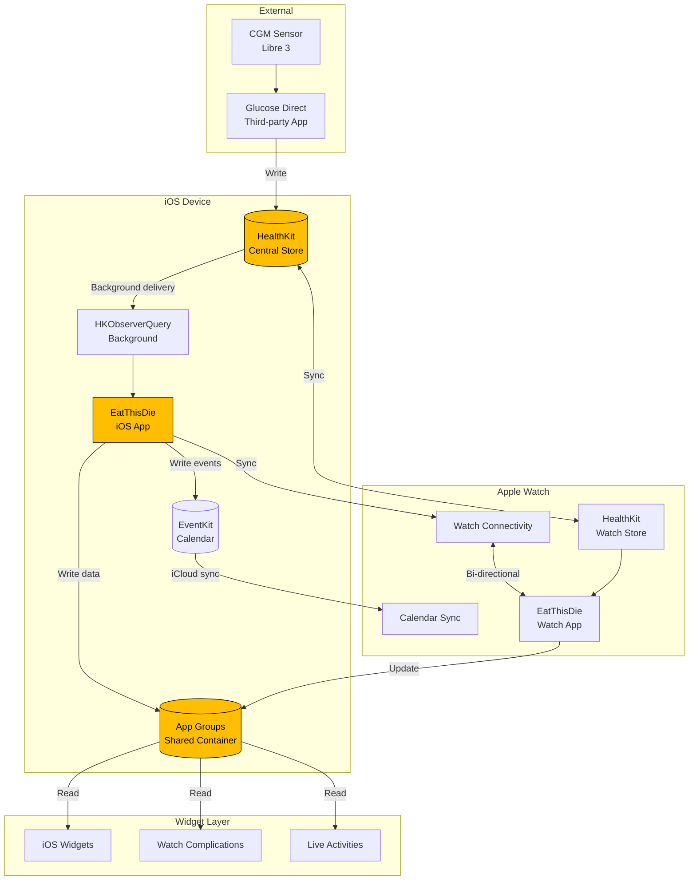

### Update Cadence Timeline

```mermaid
gantt
    title Typical Glucose Update Flow (5-minute cycle)
    dateFormat HH:mm:ss
    axisFormat %H:%M
    
    section CGM Sensor
    New reading           :milestone, 10:00:00, 0m
    
    section iOS
    HealthKit delivery    :10:00:05, 10s
    Observer callback     :10:00:15, 5s
    Process data          :10:00:20, 10s
    Write shared storage  :10:00:30, 5s
    Trigger widget reload :10:00:35, 1s
    Calendar event write  :10:00:36, 2s
    WCSession send        :10:00:38, 2s
    
    section Widgets
    Timeline refresh      :10:00:36, 15s
    Render update         :10:00:51, 2s
    
    section Watch
    Calendar sync (iCloud):10:00:40, 90s
    WCSession receive     :10:00:40, 5s
    Watch app update      :10:00:45, 5s
    Complication refresh  :10:00:50, 3s
    Calendar display      :10:02:10, 1s
```

### Update Triggers

#### Automatic Triggers

1. **HealthKit Observer Query** (iOS)
   - Trigger: New glucose sample written to HealthKit
   - Frequency: Immediate (whenever CGM app writes)
   - Typical: Every 1-5 minutes

2. **Background App Refresh** (watchOS)
   - Trigger: WKRefreshBackgroundTask scheduled
   - Frequency: System-determined (budget-based)
   - Typical: Every 15-30 minutes

3. **Widget Timeline Expiry**
   - Trigger: Timeline.Policy.after(date) expires
   - Frequency: As specified in timeline provider
   - Typical: Every 5 minutes

4. **Watch Connectivity Transfer**
   - Trigger: Application context update from iOS
   - Frequency: As iOS sends updates
   - Latency: < 5 seconds when reachable

5. **Calendar Sync** (iCloud)
   - Trigger: EventKit change notification
   - Frequency: System-determined
   - Latency: 30 seconds to 2 minutes

#### Manual Triggers

1. **Pull to Refresh** (Watch App)
2. **App Launch** (foreground activation)
3. **Complication Tap** (deep link to app)

### Data Synchronization Patterns

#### Pattern 1: iOS → Watch (Primary Flow)

```swift
// iOS App: Write and broadcast
func handleNewGlucoseReading(_ glucose: SensorGlucose) {
    let shared = SharedGlucoseData(from: glucose)
    
    // 1. Persist to shared container
    SharedGlucoseStorage()?.saveGlucose(shared)
    
    // 2. Send to watch via WCSession (fast)
    WatchConnectivityManager.shared.sendCurrentGlucose(shared)
    
    // 3. Write to calendar (slow but universal)
    if calendarExportEnabled {
        GlucoseCalendarExporter().createGlucoseEvent(
            glucose: shared,
            unit: shared.unit
        )
    }
    
    // 4. Trigger widget reloads
    WidgetCenter.shared.reloadAllTimelines()
}
```

#### Pattern 2: Watch → iOS (Food Logging)

```swift
// Watch App: Log food and send to iOS
func logFood(_ food: FoodLogEntry) {
    // 1. Save locally
    WatchOfflineStorage().cacheEntry(food)
    
    // 2. Send to iOS if reachable
    if WatchConnectivityManager.shared.isReachable {
        WatchConnectivityManager.shared.sendMessage([
            "action": "logFood",
            "data": food.dictionary
        ])
    }
    
    // 3. iOS will sync to HealthKit and shared storage
}

// iOS App: Receive and process
func handleWatchMessage(_ message: [String: Any]) {
    guard let action = message["action"] as? String else { return }
    
    switch action {
    case "logFood":
        if let data = message["data"] as? [String: Any],
           let food = FoodLogEntry(dictionary: data) {
            // Process food log
            FoodLoggingManager.shared.logFood(food)
        }
    default:
        break
    }
}
```

#### Pattern 3: Conflict Resolution

```swift
class DataSyncManager {
    func resolveConflict(
        local: SharedGlucoseData,
        remote: SharedGlucoseData
    ) -> SharedGlucoseData {
        // Strategy: Most recent timestamp wins
        if remote.timestamp > local.timestamp {
            return remote
        } else {
            return local
        }
    }
    
    func mergeData(
        localHistory: [SharedGlucoseData],
        remoteHistory: [SharedGlucoseData]
    ) -> [SharedGlucoseData] {
        // Combine and deduplicate by timestamp
        var merged = (localHistory + remoteHistory)
            .reduce(into: [Date: SharedGlucoseData]()) { dict, glucose in
                dict[glucose.timestamp] = glucose
            }
            .values
            .sorted { $0.timestamp < $1.timestamp }
        
        return Array(merged)
    }
}
```

### Offline Handling

```swift
class OfflineQueueManager {
    private var pendingOperations: [PendingOperation] = []
    
    struct PendingOperation: Codable {
        let id: UUID
        let type: OperationType
        let data: Data
        let timestamp: Date
    }
    
    enum OperationType: String, Codable {
        case glucoseUpdate
        case foodLog
        case settingsChange
    }
    
    func enqueue(_ operation: PendingOperation) {
        pendingOperations.append(operation)
        saveToDisk()
    }
    
    func syncWhenOnline() {
        guard isOnline() else { return }
        
        for operation in pendingOperations {
            switch operation.type {
            case .glucoseUpdate:
                syncGlucose(operation.data)
            case .foodLog:
                syncFoodLog(operation.data)
            case .settingsChange:
                syncSettings(operation.data)
            }
        }
        
        // Clear queue after successful sync
        pendingOperations.removeAll()
        saveToDisk()
    }
    
    private func isOnline() -> Bool {
        // Check network and WCSession reachability
        return WatchConnectivityManager.shared.isReachable ||
               NetworkMonitor.shared.isConnected
    }
}
```

---

## Security and Privacy Considerations

### Permission Model

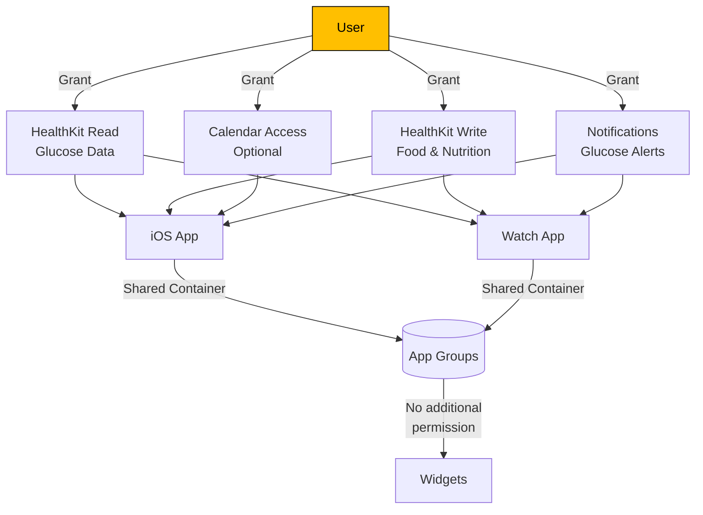

### Data Minimization

**Principle:** Store only essential data in shared containers.

#### Shared Container Data

**Allowed:**
- Current glucose value (numeric)
- Trend indicator (enum)
- Timestamp
- Unit of measurement
- Sensor state (string)

**Prohibited:**
- User personally identifiable information (PII)
- Full medical history
- Location data
- Device identifiers

#### HealthKit Data

**Primary storage** for all sensitive health data:
- Complete glucose history
- Food logs with details
- Medication records
- Exercise data
- Notes and journal entries

### Encryption

#### At Rest

```swift
// File protection for shared container files
func saveSecurely<T: Codable>(_ data: T, to filename: String) throws {
    let encoder = JSONEncoder()
    let encoded = try encoder.encode(data)
    
    guard let containerURL = FileManager.default.containerURL(
        forSecurityApplicationGroupIdentifier: "group.com.eatthisidie.shared"
    ) else {
        throw StorageError.containerNotAvailable
    }
    
    let fileURL = containerURL.appendingPathComponent(filename)
    
    // Write with file protection
    try encoded.write(
        to: fileURL,
        options: [.completeFileProtection, .atomic]
    )
}

// .completeFileProtection ensures:
// - File encrypted when device locked
// - Only accessible when device unlocked
// - Automatically handled by iOS
```

#### In Transit

- **HealthKit:** Encrypted by system
- **iCloud Calendar Sync:** End-to-end encryption (if iCloud encryption enabled)
- **Watch Connectivity:** Encrypted over Bluetooth LE
- **App Groups:** Local device only, no transit

### HIPAA Considerations

> **Note:** EatThisDie is a personal health app. HIPAA applies only if app is used by covered entities (healthcare providers, insurers). Consult legal counsel for definitive guidance.

#### Compliance Checklist

- [ ] **Minimum Necessary:** Only essential glucose data in shared storage
- [ ] **User Consent:** Explicit opt-in for all data sharing features
- [ ] **Access Controls:** Device passcode/biometric required
- [ ] **Audit Trails:** Log data access (for enterprise deployments)
- [ ] **Data Portability:** Export all user data on request
- [ ] **Right to Delete:** Complete data deletion capability
- [ ] **Encryption:** At-rest and in-transit encryption
- [ ] **Business Associate Agreements:** If integrating third-party services

#### Privacy-First Features

```swift
class PrivacyManager {
    // Lock screen complication sensitivity
    enum ComplicationPrivacy {
        case full        // Show all details
        case valueOnly   // Hide trend/delta
        case hidden      // Show generic icon only
    }
    
    static var lockScreenPrivacy: ComplicationPrivacy {
        get {
            let rawValue = UserDefaults.standard.integer(forKey: "lockScreenPrivacy")
            return ComplicationPrivacy(rawValue: rawValue) ?? .full
        }
        set {
            UserDefaults.standard.set(newValue.rawValue, forKey: "lockScreenPrivacy")
        }
    }
    
    // Calendar event privacy
    static var useGenericCalendarTitles: Bool {
        get {
            UserDefaults.standard.bool(forKey: "genericCalendarTitles")
        }
        set {
            UserDefaults.standard.set(newValue, forKey: "genericCalendarTitles")
        }
    }
    
    func formatGlucoseForDisplay(
        _ glucose: SharedGlucoseData,
        context: DisplayContext
    ) -> String {
        switch context {
        case .lockScreen where lockScreenPrivacy == .hidden:
            return "🩸"
        case .lockScreen where lockScreenPrivacy == .valueOnly:
            return "\(glucose.value)"
        case .calendar where useGenericCalendarTitles:
            return "Health Data"
        default:
            return glucose.displayValue
        }
    }
}

enum DisplayContext {
    case lockScreen
    case calendar
    case watchFace
    case fullApp
}
```

### Security Best Practices

1. **No Cloud Storage:** Keep all data on-device (HealthKit, local storage)
2. **Device Encryption:** Require device passcode/biometric
3. **Code Signing:** Apple Developer certificate validation
4. **App Transport Security:** HTTPS only for any network calls
5. **Keychain for Secrets:** Store API keys in iOS Keychain
6. **Regular Audits:** Security review before each release

---

## Appendices

### Appendix A: References

#### Apple Documentation

- [HealthKit Framework](https://developer.apple.com/documentation/healthkit)
- [EventKit Framework](https://developer.apple.com/documentation/eventkit)
- [WidgetKit](https://developer.apple.com/documentation/widgetkit)
- [Watch Connectivity](https://developer.apple.com/documentation/watchconnectivity)
- [ActivityKit (Live Activities)](https://developer.apple.com/documentation/activitykit)
- [App Intents (Siri)](https://developer.apple.com/documentation/appintents)
- [App Groups](https://developer.apple.com/documentation/xcode/configuring-app-groups)
- [Background Execution](https://developer.apple.com/documentation/backgroundtasks)

#### Third-Party Resources

- **Glucose Direct:** [GitHub Repository](https://github.com/creepymonster/GlucoseDirect)
  - Reference implementation for calendar workaround
  - Commit: d41e21d
  - License: Check repository for current license terms
  - Attribution: Inspiration for EventKit approach

#### CGM Integration

- [Freestyle Libre](https://www.freestyle.abbott/) - CGM hardware
- [LibreLinkUp](https://www.librelinkup.com/) - Cloud API for Libre 3

### Appendix B: Glossary

| Term | Definition |
|------|------------|
| **CGM** | Continuous Glucose Monitor - Sensor that measures glucose levels continuously |
| **HealthKit** | Apple's framework for storing and accessing health and fitness data |
| **EventKit** | Apple's framework for calendar and reminder management |
| **WidgetKit** | Apple's framework for creating home screen and lock screen widgets |
| **WCSession** | Watch Connectivity Session - Communication channel between iOS and watchOS |
| **App Groups** | Shared storage container accessible by multiple app extensions |
| **Timeline** | WidgetKit's system for scheduling widget updates |
| **Complication** | Apple Watch face widget showing app data |
| **Live Activity** | iOS 16.1+ persistent notification on Lock Screen and Dynamic Island |
| **HKObserverQuery** | HealthKit query that monitors for new data additions |
| **Background Delivery** | HealthKit's mechanism for waking app when new health data arrives |
| **DOS CGA** | Design aesthetic inspired by vintage DOS amber CRT monitors |

### Appendix C: Decision Trees

#### Architecture Selection Decision Tree

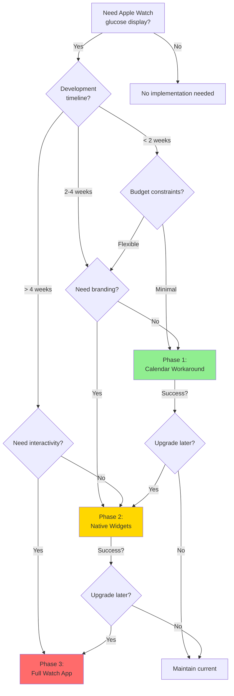

#### Runtime Feature Selection

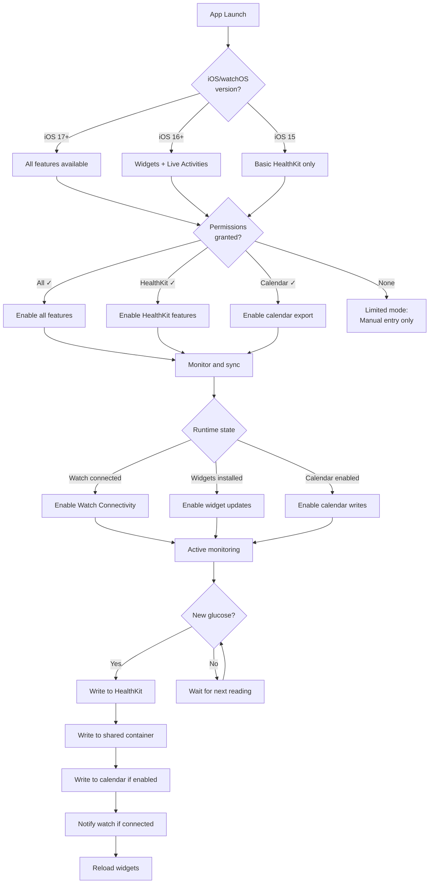

### Appendix D: Troubleshooting Guide

#### Common Issues

| Issue | Symptoms | Resolution |
|-------|----------|------------|
| **Widget not updating** | Stale glucose value | 1. Check App Groups entitlements<br/>2. Verify shared container writes<br/>3. Force widget reload<br/>4. Check WidgetKit budget |
| **Calendar sync slow** | 2+ minute delay | 1. Normal behavior (iCloud sync)<br/>2. Check network connectivity<br/>3. Verify calendar permissions<br/>4. Try different calendar (local vs iCloud) |
| **Watch disconnects** | No WCSession transfers | 1. Check Bluetooth enabled<br/>2. Verify watch paired<br/>3. Restart both devices<br/>4. Check background app refresh |
| **Background updates stop** | No automatic refreshes | 1. Check Background App Refresh setting<br/>2. Verify HealthKit background delivery<br/>3. Check battery optimization settings<br/>4. Reinstall app |
| **Permission denied** | Features unavailable | 1. Go to Settings > Privacy<br/>2. Grant required permissions<br/>3. Restart app<br/>4. Check parental controls |

#### Debug Logging

```swift
enum DebugLog {
    static var enabled: Bool {
        #if DEBUG
        return true
        #else
        return UserDefaults.standard.bool(forKey: "debugLogging")
        #endif
    }
    
    static func log(
        _ message: String,
        category: Category = .general,
        file: String = #file,
        line: Int = #line
    ) {
        guard enabled else { return }
        
        let filename = (file as NSString).lastPathComponent
        let timestamp = ISO8601DateFormatter().string(from: Date())
        
        print("[\(timestamp)] [\(category.rawValue)] \(filename):\(line) - \(message)")
        
        // Also write to file for crash analysis
        appendToLogFile(message: message, category: category)
    }
    
    enum Category: String {
        case general = "GEN"
        case healthkit = "HK"
        case calendar = "CAL"
        case widgets = "WDG"
        case watch = "WATCH"
        case sync = "SYNC"
    }
}
```

### Appendix E: Testing Checklist

#### Phase 1: Calendar Workaround

- [ ] Calendar permission request flow
- [ ] Calendar creation/selection
- [ ] Event formatting (value, trend, delta)
- [ ] Auto-cleanup after 24 hours
- [ ] Multiple watch face compatibility
- [ ] iCloud sync timing (< 2 minutes)
- [ ] High/low glucose special formatting
- [ ] Debouncing (no excessive events)

#### Phase 2: Native Widgets

- [ ] App Groups entitlements configured
- [ ] Shared container write/read
- [ ] Timeline provider returns data
- [ ] All widget families render correctly
- [ ] DOS amber CGA styling consistent
- [ ] VoiceOver labels accurate
- [ ] Dynamic Type support
- [ ] Widget updates within 30 seconds
- [ ] Battery impact < 3% per day
- [ ] Live Activities (iOS 16.1+)

#### Phase 3: Full Watch App

- [ ] Watch Connectivity session activation
- [ ] Bi-directional data sync
- [ ] Background glucose updates
- [ ] Offline data caching
- [ ] Siri shortcuts integration
- [ ] Complication tap navigation
- [ ] Food logging flow complete
- [ ] UI matches DOS amber CGA
- [ ] Accessibility (VoiceOver, haptics)
- [ ] Battery impact < 5% per day
- [ ] Stress testing (extended offline)

---

## Conclusion

This document provides three viable pathways for integrating Apple Watch glucose monitoring into EatThisDie:

1. **Calendar Workaround** - Fast MVP approach leveraging EventKit
2. **Native Widgets** - Professional complications with DOS amber branding
3. **Full watchOS App** - Complete standalone experience

**Recommended Strategy:**
- Start with **Phase 1** for rapid market validation
- Upgrade to **Phase 2** once user adoption proven
- Consider **Phase 3** for power users and competitive differentiation

All approaches integrate seamlessly with EatThisDie's existing HealthKit-centric architecture while maintaining the distinctive DOS amber CGA aesthetic.

---

**Document History:**
- v1.0 (2025-09-29): Initial comprehensive specification
- Based on research of Glucose Direct (commit d41e21d)
- Aligned with EatThisDie architecture and design system

**Next Steps:**
1. Review with development team
2. Select initial implementation phase
3. Create detailed sprint planning
4. Begin Phase 1 development